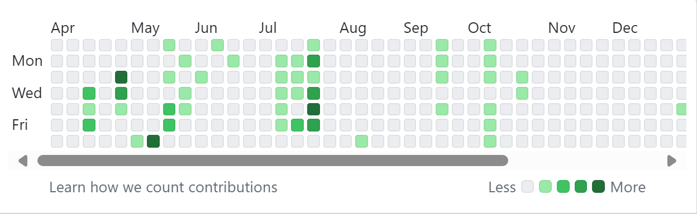
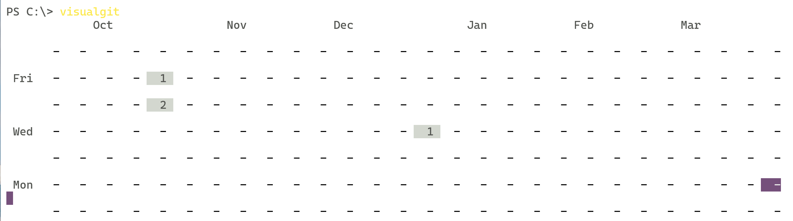

# visualgit
## 📢visualize your local git contributions
类似github的contribution图，用于查看本地的近六个月git提交记录        
        

运行效果：         
          

## 使用
使用`go install`，如果GOPATH 已经被配置，可以直接在命令行中执行`visualgit`即可
参数：
- -add扫描所添加的路径找到所有的git仓库提交记录           
- -email添加提交git所用的代码，不可缺省  
```
visualgit -add your_path_to_scan -email "youremail@gmail.com"
```
